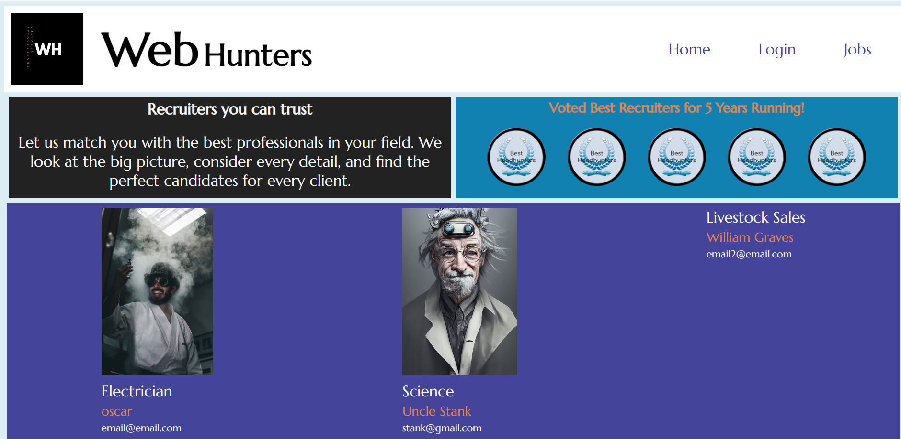

# HeadHunter

## 

## Description
* For this project, the Witty Webbers group will build a full stack web app for a fictionalized recruiting site named - Web Hunters. 
* The Witty Webbers will make sure that all code follows industry standards and is sourced correctly.

## User Story
As a headhunter, the user is able to log in to a site and post a new job and see all potential candidates for the jobs posted. When i click on a profile, I can see their resume information. In the home page the heahunter can uplaod a profile image. The user's dashboard will consist of only jobs they have posted.

As a candidate, the user is able to login and see the list of jobs. When clicking on the job title, they can see the job desciption and have an option to apply. They will be taken to the resume page and once the they hit the submit button they successfully applied for the job and the headhunter can see their information.

## Acceptance Criteria
As Headhunters, We have seen that it is very difficult to sift through the many talented candidates that apply to jobs these days. Our goal is to have a responsive site with a polished UI that will allow us to securely log in. From there, we need to be able to filter through a database of candidate resumes and view their created page when they are selected.

## Sources
Non-code related:

* Stock images - https://unsplash.com
* Funny names - https://ethanwiner.com/funnames.html 
* logo and ward maker - https://www.picmonkey.com
* color wheel - https://www.canva.com/colors/color-wheel/
* site design idea - https://designshack.net/articles/trends/best-website-color-schemes/
* html forms - Head First HTML and CSS 2nd Edition
* Database design: https://www.vertabelo.com/blog/designing-a-database-for-a-recruitment-system/
* RICE UNIVERSITY BOOT CAMP Activities for ORM and MVC.

Code related:

* Dependency packages: https://www.npmjs.com 
-  Express handlebars: https://www.npmjs.com/package/express-handlebars 
- MySQL2: https://www.npmjs.com/package/mysql2 
- Sequelize: https://www.npmjs.com/package/sequelize 
- Dotenv: https://www.npmjs.com/package/dotenv 
- Bycrypt package: https://www.npmjs.com/package/bcrypt
- Express-session: https://www.npmjs.com/package/express-session
- Connect-sequelize: https://www.npmjs.com/package/connect-session-sequelize
- Multer: https://www.npmjs.com/package/multer
* Image upload code: https://www.bezkoder.com/node-js-upload-image-mysql/
* Jquery: https://code.jquery.com/jquery-3.4.1.min.js
* Bootstrap: https://stackpath.bootstrapcdn.com/bootstrap/4.3.1/js/bootstrap.bundle.min.js

## Usage
* FROM NEW TERMINAL
* npm install OR npm i
* mysql -u root -p
* enter password for mysql
* source db/schema.sql
* exit OR quit mysql
* Bye

* npm run seed
* node server.js
* Should receive message - App is listening on port 3001!

* Open Insomnia and run tests

## Features
* Express.js
* MySQL
* Sequelize

## Link to Deployed Site - Heroku
https://warm-harbor-86414-ad2e9c539fba.herokuapp.com/

## Link to Github Repository
https://github.com/Willigrvy/HeadHunter

## Snapshot of Deployed Site

## License
MIT License

Copyright (c) 2023 Douglas Eric Marsalis

Permission is hereby granted, free of charge, to any person obtaining a copy
of this software and associated documentation files (the "Software"), to deal
in the Software without restriction, including without limitation the rights
to use, copy, modify, merge, publish, distribute, sublicense, and/or sell
copies of the Software, and to permit persons to whom the Software is
furnished to do so, subject to the following conditions:

The above copyright notice and this permission notice shall be included in all
copies or substantial portions of the Software.

THE SOFTWARE IS PROVIDED "AS IS", WITHOUT WARRANTY OF ANY KIND, EXPRESS OR
IMPLIED, INCLUDING BUT NOT LIMITED TO THE WARRANTIES OF MERCHANTABILITY,
FITNESS FOR A PARTICULAR PURPOSE AND NONINFRINGEMENT. IN NO EVENT SHALL THE
AUTHORS OR COPYRIGHT HOLDERS BE LIABLE FOR ANY CLAIM, DAMAGES OR OTHER
LIABILITY, WHETHER IN AN ACTION OF CONTRACT, TORT OR OTHERWISE, ARISING FROM,
OUT OF OR IN CONNECTION WITH THE SOFTWARE OR THE USE OR OTHER DEALINGS IN THE
SOFTWARE.
